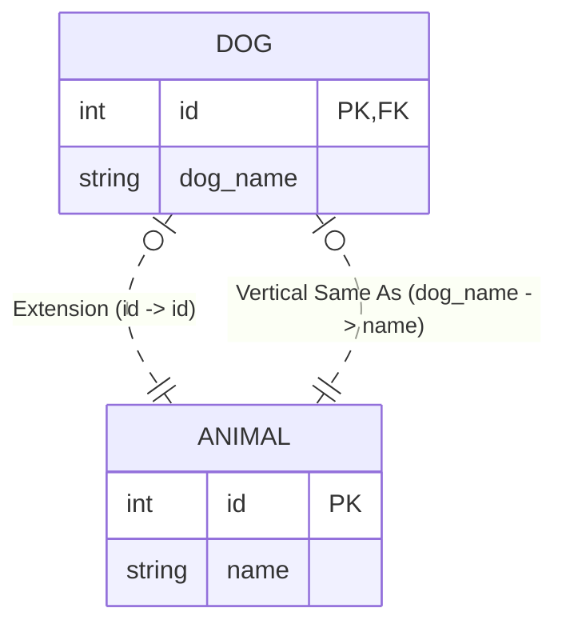
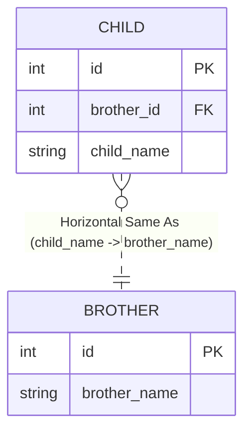
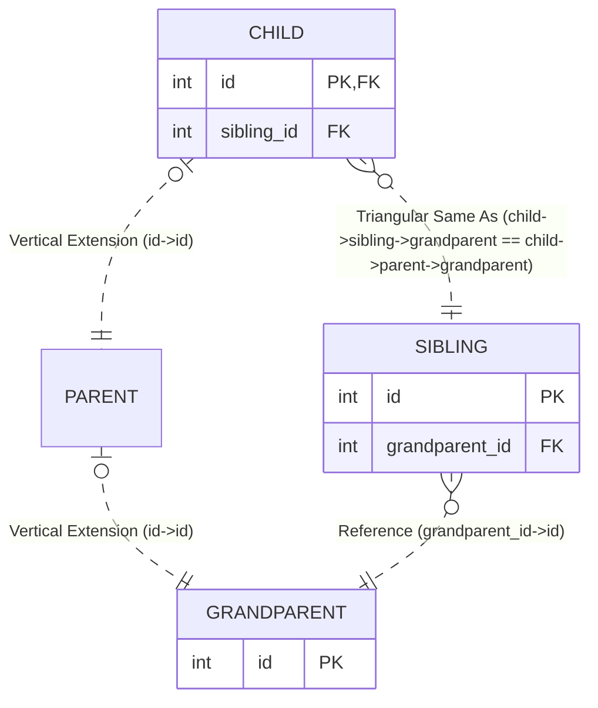

# SQL Relations

**SQL Relations** provides semantic abstractions over SQL foreign key relationships, extending the schema introspection capabilities of [sql-traits](https://github.com/earth-metabolome-initiative/sql-traits). It focuses on identifying and categorizing "Same As" relationships—where data in one table is semantically equivalent to data in another—enabling the modeling of complex schema patterns like inheritance and triangulation.

## Core Concepts

**Note**: The terms "Vertical", "Horizontal", and "Triangular" Same As are introduced by this library to describe specific topological patterns in the schema graph. They are **not standard SQL terminology**, but rather descriptive labels for semantic relationships inferred from foreign keys.

The crate specializes the **Same As** relationship into three categories:

### 1. Vertical Same As

Use cases: **Propagating Values Up the Hierarchy**, **Shared Fields in Inheritance**.

Describes the semantic equivalence between a **Column** in a child table and a **Column** in an ancestor table (other than the Primary Key).

This relies on an underlying **Extension** relationship (where the Child's Primary Key references the Ancestor's Primary Key), but "Vertical Same As" specifically refers to the mapping of additional fields.
**Motivation**: It is generally not desirable to duplicate values across tables. The primary reason for redounding these columns (and bounding them to be equal) is to enable **Complex Triangular Foreign Key Relationships**. By duplicating a specific column in the child table, it becomes available to form part of a composite foreign key constraint that wouldn't be possible otherwise.

* **Constraint**: The Child Column must implicitly or explicitly reference the Ancestor Column through the extension relationship.
* **Example**: `Dog.dog_name` is same-as `Animal.name`.
* **Implication**: The value of `dog_name` on a `Dog` row is identical to the value of `name` on the corresponding `Animal` row.

```rust
use sql_traits::prelude::*;
use sql_relations::prelude::*;
use sqlparser::dialect::GenericDialect;

let db = ParserDB::parse::<GenericDialect>(
 "
 CREATE TABLE parent (id INT PRIMARY KEY, name TEXT, UNIQUE(id, name));

 CREATE TABLE child (
  id INT PRIMARY KEY REFERENCES parent(id),
  name TEXT,
  -- This FK ensures child.name === parent.name for the same entity id
  FOREIGN KEY (id, name) REFERENCES parent(id, name)
 );
 ",
).unwrap();

let child_table = db.table(None, "child").unwrap();
let foreign_keys: Vec<_> = child_table.foreign_keys(&db).collect();

// id -> parent(id) [Extension]
// (id, name) -> parent(id, name) [Vertical Same As]
let vertical_fk = foreign_keys.iter()
 .find(|fk| fk.is_vertical_same_as(&db))
 .expect("Should identify vertical same-as FK");

assert_eq!(vertical_fk.referenced_columns(&db).count(), 2);
```



### 2. Horizontal Same As

Use cases: **Data Mirroring**, **Denormalization**.

Describes a relationship between two tables that are not in a direct extension line but share semantically identical data. This represents a "Same As" equivalence across the breadth of the schema.

* **Example**: `Order.customer_id` references `Customer.id`.
* **Implication**: The `customer_id` in `Order` is semantically equivalent to the `id` in `Customer`.

```rust
use sql_traits::prelude::*;
use sql_relations::prelude::*;
use sqlparser::dialect::GenericDialect;

let db = ParserDB::parse::<GenericDialect>(
 "
 CREATE TABLE brother (
  id INT PRIMARY KEY, 
  brother_name TEXT, 
  UNIQUE(id, brother_name)
 );

 CREATE TABLE child (
  id INT PRIMARY KEY,
  brother_id INT,
  child_name TEXT,
  -- This FK ensures child.child_name === brother.brother_name when linked
  FOREIGN KEY (brother_id, child_name) REFERENCES brother(id, brother_name)
 );
 ",
).unwrap();

let child_table = db.table(None, "child").unwrap();
let foreign_keys: Vec<_> = child_table.foreign_keys(&db).collect();

let horizontal_fk = foreign_keys.iter()
 .find(|fk| fk.is_horizontal_same_as(&db))
 .expect("Should identify horizontal same-as FK");

// (brother_id, child_name) -> brother(id, brother_name)
assert_eq!(horizontal_fk.referenced_columns(&db).count(), 2);
```



### 3. Triangular Same As

Use cases: **Complex Ownership**, **Junction Tables**, **Diamond Dependencies**.

Describes a relationship involving three entities forming a triangle. This happens when:

* Table `A` extends Ancestor `C` (Vertical).
* Table `A` also references Table `B` (Horizontal).
* Table `B` also references Ancestor `C`.

This topology creates a "triangular" constraint where the path from `A` to `C` can be traversed directly (vertical extension) or indirectly (via `B`).

* **Mandatory Triangular**: The indirect path *must* point to the same ancestor record as the direct path.
* **Discretionary Triangular**: The indirect path *may* point to a different record (or is independent).

**Verifiable Rust Example (Mandatory)**:

```rust
use sql_traits::prelude::*;
use sql_relations::prelude::*;
use sqlparser::dialect::GenericDialect;

let db = ParserDB::parse::<GenericDialect>(
 "
 CREATE TABLE grandparent (id INT PRIMARY KEY);
 CREATE TABLE parent (id INT PRIMARY KEY REFERENCES grandparent(id));

 -- Sibling also points to grandparent
 CREATE TABLE sibling (
  id INT PRIMARY KEY, 
  grandparent_id INT REFERENCES grandparent(id), 
  UNIQUE(id, grandparent_id)
 );

 CREATE TABLE child (
  id INT PRIMARY KEY REFERENCES parent(id), -- Path 1 to Top
  sibling_id INT REFERENCES sibling(id),
  
  -- Triangular Constraint:
  -- Ensures that the 'sibling' linked to this 'child' 
  -- points to the SAME 'grandparent' as this 'child'.
  FOREIGN KEY (sibling_id, id) REFERENCES sibling(id, grandparent_id)
 );
 ",
).unwrap();

let child_table = db.table(None, "child").unwrap();
let foreign_keys: Vec<_> = child_table.foreign_keys(&db).collect();

let triangular_fk = foreign_keys.iter()
 .find(|fk| fk.is_triangular_same_as(&db))
 .expect("Should identify triangular same-as FK");

// This checks if the triangularity is mandatory (enforced by constraint)
assert!(triangular_fk.triangular_same_as(&db).unwrap().is_mandatory());
```



## Dependencies

* **[sql-traits](https://github.com/earth-metabolome-initiative/sql-traits)**: Provides the fundamental database introspection traits (`TableLike`, `ForeignKeyLike`, etc.) that this crate extends with semantic logic.

## Usage

This crate is a core component of [SynQL](https://github.com/earth-metabolome-initiative/synql), used to generate type-safe Rust comparisons and builder patterns that respect these semantic relationships.

```toml
[dependencies]
sql_relations = { git = "https://github.com/earth-metabolome-initiative/synql" }
```
